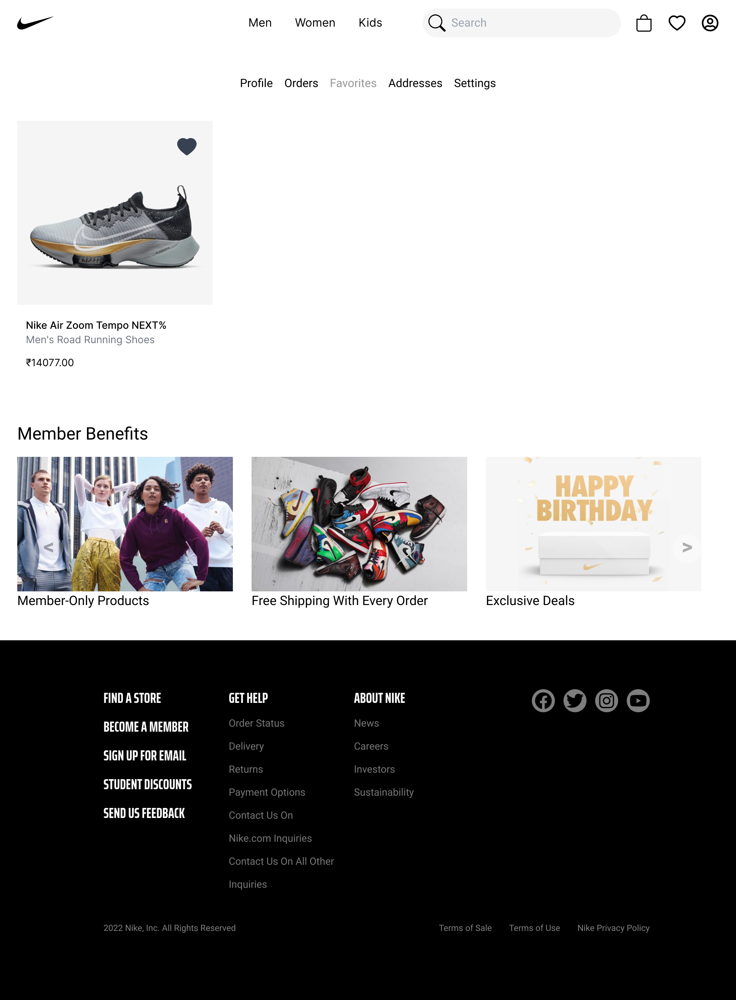
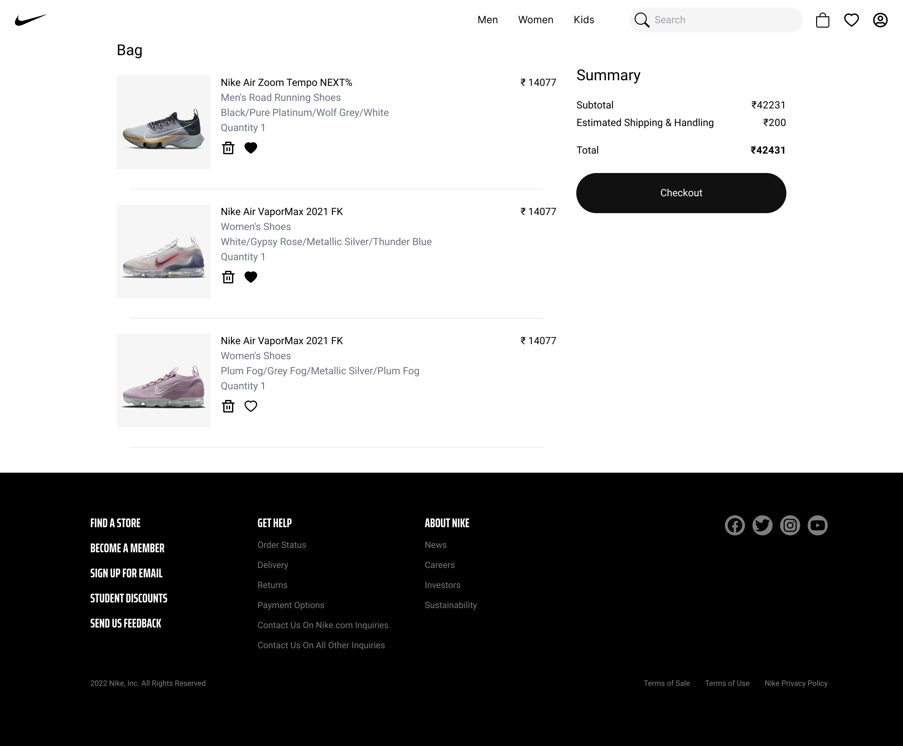
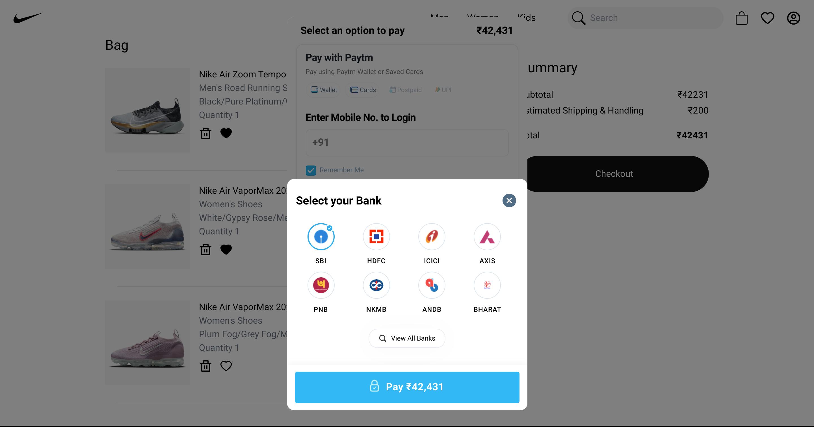

# Nike Clone

  
  
  
  
  
  

## Live Demo

- Go to https://nike-online.ddns.net/ for live demo.

## How to run this on localhost?

This project was bootstrapped with [CRA](https://reactjs.org/docs/create-a-new-react-app.html). Follow these steps to clone and run this project in your local machine:

- run `yarn install`

- run `yarn start` to start react server

- run `yarn start-api` to start [Flask server](https://flask.palletsprojects.com/en/2.1.x/)

Dont forget to add following environment variables in a .env file in root folder:

- `REACT_APP_PAYTM_MID` : Merchent ID from [PayTM](https://business.paytm.com/payment-gateway)

Add the following environment variables in .env file inside api folder:

- `SECRET_KEY` : secret key for flask app
- `JWT_SECRET_KEY` : secret key for [JWT module](https://flask-jwt-extended.readthedocs.io/en/stable/options/#JWT_SECRET_KEY)
- `PAYTM_MID` : Merchent ID from PayTM
- `PAYTM_MERCHENT_KEY` : Merchent ket from PayTM 

Run `yarn build` to create a production build.

## Features

- User Authentication using JWT. Auth using refresh token.

- Product data scraped from [Nike India Sale](https://www.nike.com/in/w/sale-3yaep) page.

- PayTM payments gateway.

- Product filters by gender and product category

- Option to add products to favorites.

## Screenshots

  
  
  

